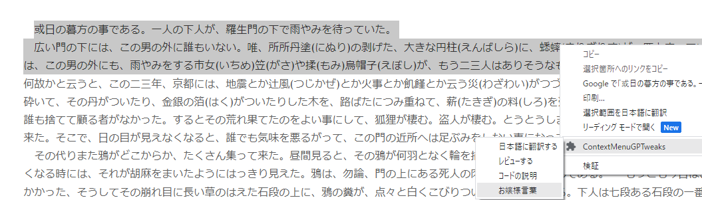
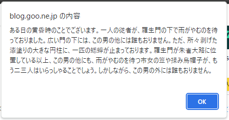

# context-gpt-extension

コンテキストメニューから選択したテキストをchatGPTに送信し、返答を表示するChrome拡張機能です。

### 機能一覧
- 翻訳
  - 選択したテキストを日本語に翻訳します。

- コード説明
  - 選択したテキストを説明します。

- コードレビュー
  - 選択したテキストのレビュー結果を箇条書きにします。

### ユーザープロンプト機能
ユーザーが自由にプロンプトを追加可能です。

## インストール方法
### リポジトリからインストールする場合

1. ターミナル上で任意のディレクトリに移動し、`git clone https://github.com/KentoAdachi/gpt-contextmenu-extension` を使用してこのリポジトリをクローンします。
1. `chrome://extensions/` を開きます。
1. 右上の「デベロッパーモード」をオンにします。
1. 「パッケージ化されていない拡張機能を読み込む」をクリックします。
1. クローンしたリポジトリのディレクトリを選択します。

## 使用方法

1. オプション画面で ChatGPT API Key を設定します。
1. ブラウザ上で右クリックし、コンテキストメニューからプロンプトを選択します。
2. ChatGPTからの返答が表示されます。
